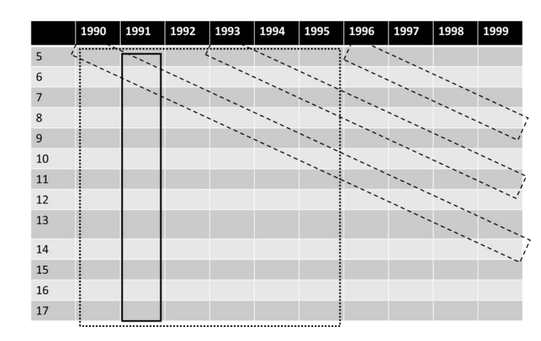

## &nbsp; {.center}

:::: {.columns .apc-cols}

::: {.column}
[Age]{.apc-head .age}

::: {.apc-def .age}
changes over the life course of individuals
:::

Biology

Risk aversion

Vitality

Political views
:::

::: {.column}
[Period]{.apc-head .period}

::: {.apc-def .period}
changes due to the events in particular years
:::

Technological disruption

Pandemics (e.g. Covid)

Recession
:::

::: {.column}
[Cohort]{.apc-head .cohort}

::: {.apc-def .cohort}
changes due to the replacement of older cohorts of individuals with younger ones with different characteristics
:::

Generation X *(1965 – 1980)*

Millenials *(1981 – 1996)*

Generation Z *(1997 – 2012)*

Generation Alpha *(2012 – 2020)*
:::

::::

## &nbsp; {.center}

::: {.big-eq}
$$\text{Age} = \text{Period} - \text{Cohort}$$
:::

::: {.eq-gloss}
(Age = Calendar year – Birth year)
:::

## The identification problem: linear effects {.smaller}

::: {.fragment}
$$\text{Observation} = \beta_A\,\text{Age} + \beta_P\,\text{Period} + \beta_C\,\text{Cohort} + \text{Error}$$
:::

::: {.fragment}
$$\beta_A' = \beta_A + c \qquad \beta_P' = \beta_P - c \qquad \beta_C' = \beta_C + c$$
:::

::: {.fragment}
$$
\begin{aligned}
\text{Observation} &= \beta_A'\,\text{Age} + \beta_P'\,\text{Period} + \beta_C'\,\text{Cohort} + \text{Error} \\
               &= \beta_A\,\text{Age} + \beta_P\,\text{Period} + \beta_C\,\text{Cohort} + c\,(\text{Age} - \text{Period} + \text{Cohort}) + \text{Error} \\
               &= \beta_A\,\text{Age} + \beta_P\,\text{Period} + \beta_C\,\text{Cohort} + \text{Error}
\end{aligned}
$$
:::

::: {.example-box .fragment}
[Example]{.example-title}

Assume $\beta_A = \beta_P = \beta_C = 1$ and $c = -1$

::: {.fragment .model-true}
*True model:* &nbsp; $\text{Observation} = 1 \cdot \text{Age} + 1 \cdot \text{Period} + 1 \cdot \text{Cohort} + \text{Error}$
:::

::: {.fragment .model-detect}
*Fitted model:* &nbsp; $\text{Observation} = 2 \cdot \text{Period} + \text{Error}$
:::
:::

## The positive case

:::: {.columns .positive-case}

::: {.column width="55%"}
{.id-figure}
:::

::: {.column width="47%"}
**Example (continued):**

Assume $\beta_A = \beta_P = \beta_C = 1$ and we know $\beta_P = 1$

Estimate $\beta_A' = \beta_C' = 0$ and $\beta_P' = 2$

$(0,\, 2,\, 0) = (\beta_A,\, 1,\, \beta_C) + c\,(1, -1, 1)$
:::

::::

## APC - how is it a problem {.smaller}

:::: {.columns .summary-cols}

::: {.column width="46%"}
::: {.sum-card .card-a}
**Only linear effects are affected**

Discrete effects and non-linear variation still identifiable.
:::

::: {.sum-card .card-b}
**No point estimates**

APC parameters are restricted to a *line of solutions*, once data is known.
:::

::: {.sum-card .card-c}
**Mechanically unsolvable**

The APC identification problem cannot be solved without (strong) assumptions.
:::
:::

::: {.column width="54%"}
{.fig-data}

::: {.design-notes}
**APC in different study designs**

- **Cross-sectional** (solid): age ↔ cohort confounded
- **Single cohort** (dashed): age ↔ period confounded
- **Combined cohorts / cross-sectional** (dotted + all dashed): all of A, P, C vary — yet the linear problem remains
:::
:::

::::

## 'Solutions': without assumptions {.smaller}

:::: {.columns .card-cols}

::: {.column}
::: {.pcard .ok}
**Example: Line of solution**

Recall $$\beta_A' = \beta_A + c \quad \beta_P' = \beta_P - c \quad \beta_C' = \beta_C + c$$

[Individual change effect: $\quad \beta_A' + \beta_P' = \beta_A + \beta_P$]{.eff}

[Cohort replacement effect: $\quad \beta_C' + \beta_P' = \beta_C + \beta_P$]{.eff}

**Limitation:** now identifiable, but confounds two effects. Risk misinterpretation.
:::
:::

::: {.column}
::: {.pcard .warn}
**Example: Hierarchical APC**

<svg viewBox="0 0 360 210" class="hapc-svg" xmlns="http://www.w3.org/2000/svg">
  <defs>
    <marker id="hapcArrow" markerWidth="8" markerHeight="8" refX="6" refY="3" orient="auto">
      <path d="M0,0 L6,3 L0,6 Z" fill="#444"></path>
    </marker>
  </defs>
  <g fill="white" stroke="#444" stroke-width="1.6">
    <rect x="35" y="10" width="120" height="54"></rect>
    <rect x="205" y="10" width="120" height="54"></rect>
    <rect x="55" y="150" width="250" height="54"></rect>
  </g>
  <g stroke="#444" stroke-width="1.6">
    <line x1="165" y1="150" x2="105" y2="70" marker-end="url(#hapcArrow)"></line>
    <line x1="195" y1="150" x2="255" y2="70" marker-end="url(#hapcArrow)"></line>
  </g>
  <g font-size="19" fill="#1f2933" text-anchor="middle">
    <text x="95" y="44">Period</text>
    <text x="265" y="44">Cohort</text>
    <text x="180" y="184">Individual (Age)</text>
  </g>
</svg>

Individuals (age) cross-classified within period and cohort random effects (Yang & Land).

**Limitation:** bias of the linear cohort effect towards zero.
:::
:::

::::

::: {.cite}
Bell (2020), Annals of Human Biology.
:::

## 'Solutions': with assumptions {.smaller}

Make the assumption explicit and theory-based.

:::: {.columns .card-cols}

::: {.column}
::: {.pcard .ok}
**Example: Categorical APC**

Model A, P, C as categories.

This identifies the non-linear effects (curvature and discrete jumps) around possibly unknown linear trends.

**Limitation:** the linear trends stay unidentified.
:::
:::

::: {.column}
::: {.pcard .c1}
**Example: Mechanism-based**

Replace one APC variable with the real driver behind it (e.g. swap cohort for a measure of medical technology).

That driver is not collinear with A, P, C, so identification is restored. Explain one dimension fully and the other two follow.

**Limitation:** you must know and measure the true mechanism. A partial or wrong driver can provide poor estimates.
:::
:::

::::

::: {.cite}
Bell (2020), Annals of Human Biology.
:::
